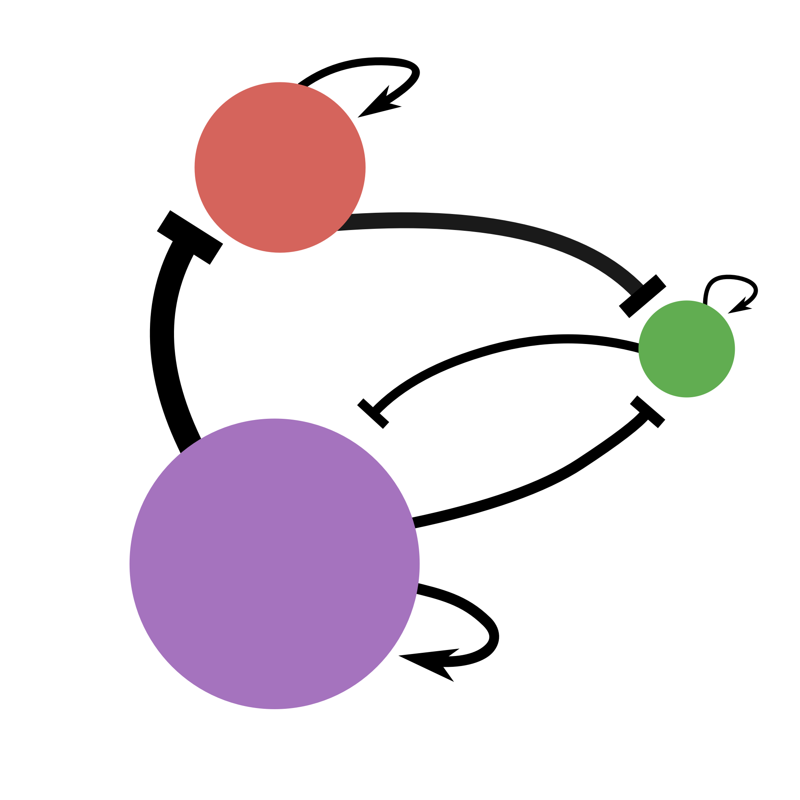

# GeneRegulatorySystems App

<a href="https://github.com/drostlab/GeneRegulatorySystems-App/releases/latest">
  
</a>

<p align="center">
  
</p>

Graphical user interface (GUI) for [GeneRegulatorySystems.jl](https://github.com/drostlab/GeneRegulatorySystems.jl/), a tool for designing complex simulation schedules of stochastic gene regulatory networks. Software documentation is available at <https://drostlab.github.io/GeneRegulatorySystems.jl/>.

## Installation

Download the latest app release from the [Releases page](https://github.com/drostlab/GeneRegulatorySystems-App/releases). This will automatically install all the required dependencies and start up the app in a desktop window.

## Developer mode

```sh
git clone https://github.com/drostlab/GeneRegulatorySystems-App.git
cd GeneRegulatorySystems-App
./dev.sh
```

This starts the Vue frontend and Julia backend in browser mode. Dependencies are installed automatically on first run. [Node.js](https://nodejs.org/en/download) >= 20, [Julia](https://julialang.org/downloads/) >= 1.11 are required.

For the native desktop window:

```sh
./dev.sh --tauri
```

This requires [Rust](https://rust-lang.org/tools/install/) >= 1.77 to be installed additionally.

### Production build

```sh
cd tauri-app
cargo tauri build
```

Output is written to `tauri-app/target/release/bundle/`. See [tauri-app/README.md](tauri-app/README.md) for details.
